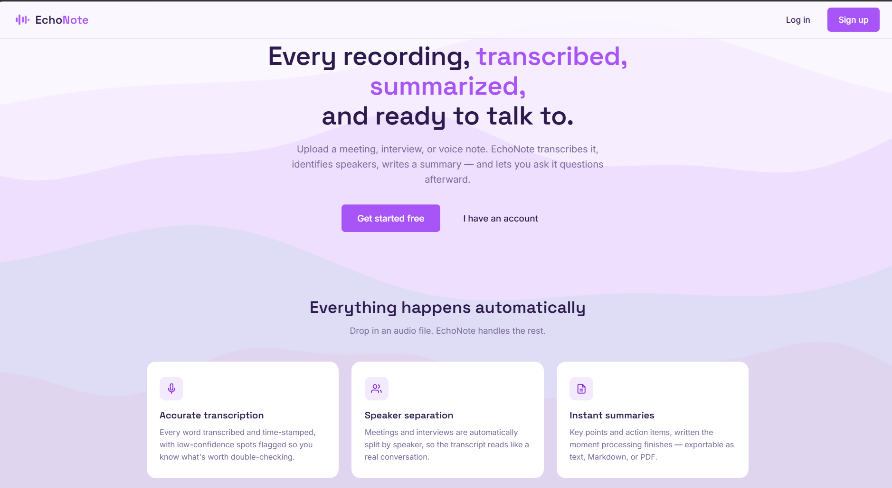
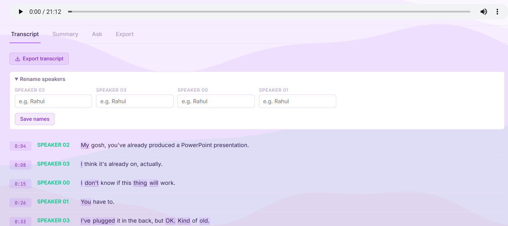
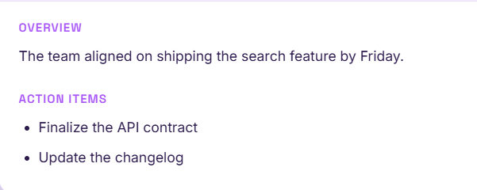
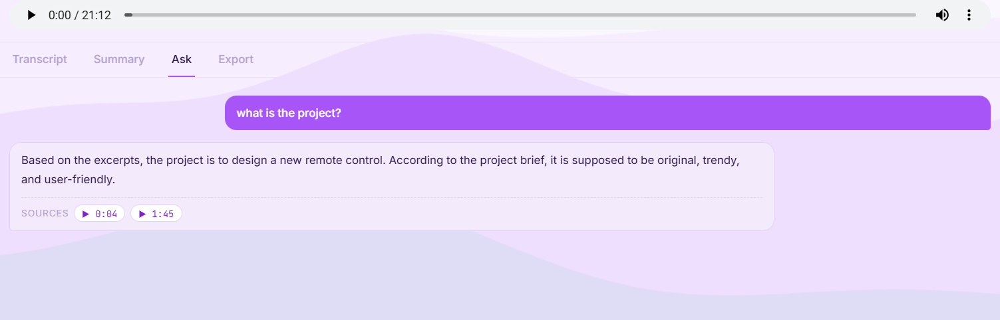
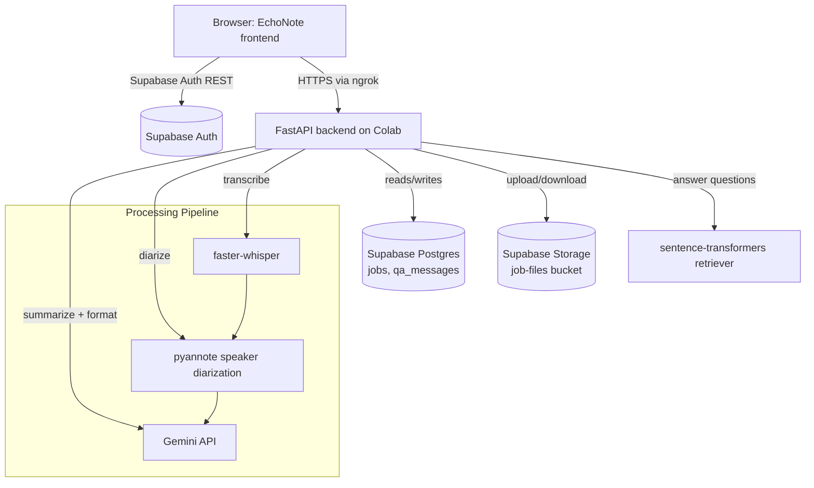

# EchoNote

Every recording, transcribed, summarized, and ready to talk to.

EchoNote is a full-stack app that turns audio recordings — meetings, interviews,
speeches, voice notes — into searchable transcripts, speaker-labeled conversations,
AI-generated summaries, and a chat interface for asking questions about what was said.

<!-- 📸 ADD SCREENSHOT: Landing page hero -->


## Features

- 🎙️ **Transcription** — faster-whisper with word-level timestamps; low-confidence words are highlighted so you know what to double-check
- 🗣️ **Speaker diarization** — separates who said what, and you can rename `SPEAKER_00` to real names (applied across the transcript, exports and Q&A)
- 📝 **AI summaries** — key points and action items, generated automatically
- 💬 **Timestamped Q&A** — ask questions about a recording; answers cite the exact moments they came from, and clicking a source jumps the audio to that point
- 🔊 **Audio playback** — listen in the app and click any transcript line to seek
- 📤 **Export** — transcripts and summaries as .txt, .md, or .pdf
- 🔒 **Per-user isolation** — Supabase Auth + Row-Level Security

<!-- 📸 Transcript tab with speaker labels -->


<!-- 📸 Summary tab -->


<!-- 📸 Ask/chat tab -->


## Tech stack

**Frontend:** Vanilla HTML/CSS/JS (no build step), Supabase Auth (direct REST calls)

**Backend:** FastAPI, faster-whisper, pyannote, Gemini API (summaries and answers), sentence-transformers (`bge-base-en-v1.5` embeddings + `bge-reranker-base` reranking), ffmpeg, Supabase (Postgres + Storage + Auth)

## Architecture

<!-- 📸 architecture / data flow -->


## Setup

### Backend

The backend runs as a Jupyter/Colab notebook (`backend/cadence_backend.ipynb`).

1. Open the notebook in Google Colab
2. Add these secrets via Colab's 🔑 secrets panel (never hardcode them):
   - `SUPABASE_URL`
   - `SUPABASE_SERVICE_ROLE_KEY`
   - `GEMINI_API_KEY` (or your chosen LLM provider key)
3. Run all cells top to bottom
4. Copy the printed `ngrok` URL — you'll need it for the frontend

### Database setup (Supabase)

Run this in your Supabase SQL Editor:

```sql
-- Core tables
create table jobs (
  id uuid primary key,
  user_id uuid not null,
  status text,
  purpose text,
  filename text,
  title text,
  transcript text,
  speaker_transcript text,
  summary text,
  transcript_url text,
  summary_url text,
  audio_url text,
  segments jsonb,
  speaker_names jsonb default '{}'::jsonb,
  transcript_word_confidence jsonb,
  formatted_output text,
  error text,
  created_at timestamptz default now()
);

create table qa_messages (
  id uuid primary key default gen_random_uuid(),
  job_id uuid references jobs(id),
  question text,
  answer text,
  sources jsonb,
  created_at timestamptz default now()
);

-- Row-Level Security
alter table jobs enable row level security;
alter table qa_messages enable row level security;
```

Create a Storage bucket named `job-files`, and add a policy allowing `service_role` full access.

### Frontend

1. Open `frontend/cadence.html` in a browser, or host it anywhere static (GitHub Pages, Netlify, etc.)
2. Click the ⚙ settings icon and fill in:
   - Your Supabase project URL
   - Your Supabase **anon** key (Settings → API in Supabase dashboard — not the service role key)
   - Your backend's `ngrok` URL
3. Sign up and start uploading recordings

## Known limitations

- Backend runs on Colab + ngrok, so the URL changes on every restart (not production-hosted yet)
- Jobs process sequentially (single worker); jobs in progress are marked failed if the server restarts
- Speaker labels can be wrong on very short utterances
- Depends on the Gemini API, which can return 503s under load (requests are retried)

## License

All rights reserved. This code is shared publicly for portfolio/demonstration purposes only — 
it is not licensed for reuse, modification, or redistribution without explicit permission.